Lab 09: Algorithmic Bias
================
Cailey Fay
3.17.26

## Load Packages and Data

First, let’s load the necessary packages:

``` r
library(tidyverse)
library(fairness)
```

    ## Warning: package 'fairness' was built under R version 4.5.2

``` r
library(readr)
library(janitor)
```

### The data

For this lab, we’ll use the COMPAS dataset compiled by ProPublica. The
data has been preprocessed and cleaned for you. You’ll have to load it
yourself. The dataset is available in the `data` folder, but I’ve
changed the file name from `compas-scores-two-years.csv` to
`compas-scores-2-years.csv`. I’ve done this help you practice debugging
code when you encounter an error.

``` r
compas <- read_csv("data/compas-scores-2-years.csv") %>%
  clean_names() %>%
  rename(
    decile_score = decile_score_12,
    priors_count = priors_count_15)
```

    ## New names:
    ## Rows: 7214 Columns: 53
    ## ── Column specification
    ## ──────────────────────────────────────────────────────── Delimiter: "," chr
    ## (19): name, first, last, sex, age_cat, race, c_case_number, c_charge_de... dbl
    ## (19): id, age, juv_fel_count, decile_score...12, juv_misd_count, juv_ot... lgl
    ## (1): violent_recid dttm (2): c_jail_in, c_jail_out date (12):
    ## compas_screening_date, dob, c_offense_date, c_arrest_date, r_offe...
    ## ℹ Use `spec()` to retrieve the full column specification for this data. ℹ
    ## Specify the column types or set `show_col_types = FALSE` to quiet this message.
    ## • `decile_score` -> `decile_score...12`
    ## • `priors_count` -> `priors_count...15`
    ## • `decile_score` -> `decile_score...40`
    ## • `priors_count` -> `priors_count...49`

``` r
glimpse(compas)
```

    ## Rows: 7,214
    ## Columns: 53
    ## $ id                      <dbl> 1, 3, 4, 5, 6, 7, 8, 9, 10, 13, 14, 15, 16, 18…
    ## $ name                    <chr> "miguel hernandez", "kevon dixon", "ed philo",…
    ## $ first                   <chr> "miguel", "kevon", "ed", "marcu", "bouthy", "m…
    ## $ last                    <chr> "hernandez", "dixon", "philo", "brown", "pierr…
    ## $ compas_screening_date   <date> 2013-08-14, 2013-01-27, 2013-04-14, 2013-01-1…
    ## $ sex                     <chr> "Male", "Male", "Male", "Male", "Male", "Male"…
    ## $ dob                     <date> 1947-04-18, 1982-01-22, 1991-05-14, 1993-01-2…
    ## $ age                     <dbl> 69, 34, 24, 23, 43, 44, 41, 43, 39, 21, 27, 23…
    ## $ age_cat                 <chr> "Greater than 45", "25 - 45", "Less than 25", …
    ## $ race                    <chr> "Other", "African-American", "African-American…
    ## $ juv_fel_count           <dbl> 0, 0, 0, 0, 0, 0, 0, 0, 0, 0, 0, 0, 0, 0, 0, 0…
    ## $ decile_score            <dbl> 1, 3, 4, 8, 1, 1, 6, 4, 1, 3, 4, 6, 1, 4, 1, 3…
    ## $ juv_misd_count          <dbl> 0, 0, 0, 1, 0, 0, 0, 0, 0, 0, 0, 0, 0, 0, 0, 0…
    ## $ juv_other_count         <dbl> 0, 0, 1, 0, 0, 0, 0, 0, 0, 0, 0, 0, 0, 0, 0, 0…
    ## $ priors_count            <dbl> 0, 0, 4, 1, 2, 0, 14, 3, 0, 1, 0, 3, 0, 0, 1, …
    ## $ days_b_screening_arrest <dbl> -1, -1, -1, NA, NA, 0, -1, -1, -1, 428, -1, 0,…
    ## $ c_jail_in               <dttm> 2013-08-13 06:03:42, 2013-01-26 03:45:27, 201…
    ## $ c_jail_out              <dttm> 2013-08-14 05:41:20, 2013-02-05 05:36:53, 201…
    ## $ c_case_number           <chr> "13011352CF10A", "13001275CF10A", "13005330CF1…
    ## $ c_offense_date          <date> 2013-08-13, 2013-01-26, 2013-04-13, 2013-01-1…
    ## $ c_arrest_date           <date> NA, NA, NA, NA, 2013-01-09, NA, NA, 2013-08-2…
    ## $ c_days_from_compas      <dbl> 1, 1, 1, 1, 76, 0, 1, 1, 1, 308, 1, 0, 0, 1, 4…
    ## $ c_charge_degree         <chr> "F", "F", "F", "F", "F", "M", "F", "F", "M", "…
    ## $ c_charge_desc           <chr> "Aggravated Assault w/Firearm", "Felony Batter…
    ## $ is_recid                <dbl> 0, 1, 1, 0, 0, 0, 1, 0, 0, 1, 0, 1, 0, 0, 1, 1…
    ## $ r_case_number           <chr> NA, "13009779CF10A", "13011511MM10A", NA, NA, …
    ## $ r_charge_degree         <chr> NA, "(F3)", "(M1)", NA, NA, NA, "(F2)", NA, NA…
    ## $ r_days_from_arrest      <dbl> NA, NA, 0, NA, NA, NA, 0, NA, NA, 0, NA, NA, N…
    ## $ r_offense_date          <date> NA, 2013-07-05, 2013-06-16, NA, NA, NA, 2014-…
    ## $ r_charge_desc           <chr> NA, "Felony Battery (Dom Strang)", "Driving Un…
    ## $ r_jail_in               <date> NA, NA, 2013-06-16, NA, NA, NA, 2014-03-31, N…
    ## $ r_jail_out              <date> NA, NA, 2013-06-16, NA, NA, NA, 2014-04-18, N…
    ## $ violent_recid           <lgl> NA, NA, NA, NA, NA, NA, NA, NA, NA, NA, NA, NA…
    ## $ is_violent_recid        <dbl> 0, 1, 0, 0, 0, 0, 0, 0, 0, 1, 0, 0, 0, 0, 0, 0…
    ## $ vr_case_number          <chr> NA, "13009779CF10A", NA, NA, NA, NA, NA, NA, N…
    ## $ vr_charge_degree        <chr> NA, "(F3)", NA, NA, NA, NA, NA, NA, NA, "(F2)"…
    ## $ vr_offense_date         <date> NA, 2013-07-05, NA, NA, NA, NA, NA, NA, NA, 2…
    ## $ vr_charge_desc          <chr> NA, "Felony Battery (Dom Strang)", NA, NA, NA,…
    ## $ type_of_assessment      <chr> "Risk of Recidivism", "Risk of Recidivism", "R…
    ## $ decile_score_40         <dbl> 1, 3, 4, 8, 1, 1, 6, 4, 1, 3, 4, 6, 1, 4, 1, 3…
    ## $ score_text              <chr> "Low", "Low", "Low", "High", "Low", "Low", "Me…
    ## $ screening_date          <date> 2013-08-14, 2013-01-27, 2013-04-14, 2013-01-1…
    ## $ v_type_of_assessment    <chr> "Risk of Violence", "Risk of Violence", "Risk …
    ## $ v_decile_score          <dbl> 1, 1, 3, 6, 1, 1, 2, 3, 1, 5, 4, 4, 1, 2, 1, 2…
    ## $ v_score_text            <chr> "Low", "Low", "Low", "Medium", "Low", "Low", "…
    ## $ v_screening_date        <date> 2013-08-14, 2013-01-27, 2013-04-14, 2013-01-1…
    ## $ in_custody              <date> 2014-07-07, 2013-01-26, 2013-06-16, NA, NA, 2…
    ## $ out_custody             <date> 2014-07-14, 2013-02-05, 2013-06-16, NA, NA, 2…
    ## $ priors_count_49         <dbl> 0, 0, 4, 1, 2, 0, 14, 3, 0, 1, 0, 3, 0, 0, 1, …
    ## $ start                   <dbl> 0, 9, 0, 0, 0, 1, 5, 0, 2, 0, 0, 4, 1, 0, 0, 0…
    ## $ end                     <dbl> 327, 159, 63, 1174, 1102, 853, 40, 265, 747, 4…
    ## $ event                   <dbl> 0, 1, 0, 0, 0, 0, 1, 0, 0, 1, 0, 1, 0, 0, 1, 1…
    ## $ two_year_recid          <dbl> 0, 1, 1, 0, 0, 0, 1, 0, 0, 1, 0, 1, 0, 0, 1, 1…

## Exercise 1

There are 7214 rows and 53 columns of the frame. Each row represents a
person.

## Exercise 2

There are 7158 unique people in the frame. This is not the same as the
total number of observations, perhaps because some repeat offenders get
listed twice.

## Exercise 3

The distribution is quite flat, but concentrated at the lower scores.

``` r
hist(compas$decile_score)
```

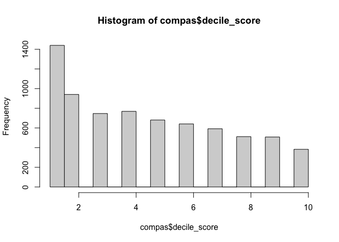<!-- --> \## Exercise
4

``` r
ggplot(compas, mapping = aes(x=fct_infreq(race), fill = race)) +
  geom_bar() +
 # coord_polar(theta = "y") +
  theme_minimal() + 
  theme(legend.position = "none") +
  labs(title = "Distribution of Race",
       y= "Frequency",
       x = "Race") +
  scale_fill_brewer()
```

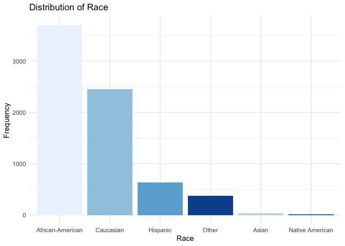<!-- -->

``` r
ggplot(compas, mapping = aes(x=sex, fill = sex)) +
  geom_bar() +
  theme_minimal() + 
  theme(legend.position = "none") +
  labs(title = "Defendant Sex",
       y= "Frequency",
       x = "Sex") +
  scale_fill_brewer()
```

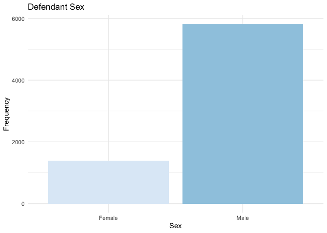<!-- -->

``` r
ggplot(compas, mapping = aes(x=age_cat, fill = age_cat)) +
  geom_bar() +
  theme_minimal() + 
  theme(legend.position = "none") +
  labs(title = "Defendant Age",
       y= "Frequency",
       x = "Age Category") +
  scale_fill_brewer()
```

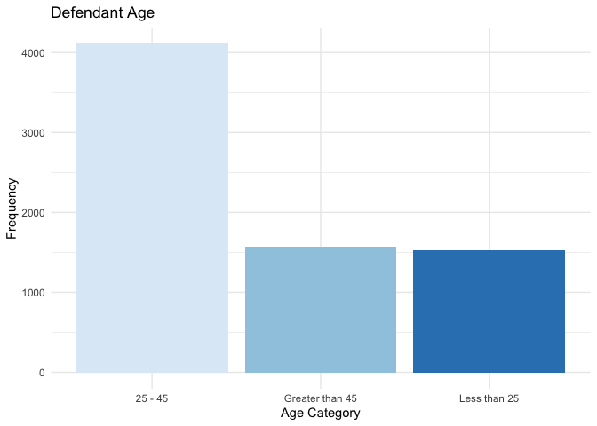<!-- -->

## Excercise 4 Stretch

I might revisit this, but right now I want to invest my time elsewhere.

```
ggplot(compas, mapping = aes(x=age_cat, fill = age_cat)) +
  geom_bar() +
  theme_minimal() + 
  theme(legend.position = "none") +
  labs(title = "Defendant Age",
       y= "Frequency",
       x = "Age Category") +
  scale_fill_brewer() +
  facet_grid(~race, age_cat, race)
```

## Exercise 5

They do correspond with actual recidivism, but not remarkably so. This
chart isn’t amazing but it gets my point across. 0 = no reoffense, 1 =
reoffense.

``` r
compas <- compas %>%
  mutate(nom_decile_score = as.factor(decile_score))


ggplot(compas, mapping = aes(x = nom_decile_score, fill = as.factor(two_year_recid))) +
  geom_bar(position = "fill") +
  scale_fill_brewer() +
  theme_minimal() + 
  labs(title = "Proportion of Actual Recidivism by Risk Class",
                    x = "Risk Decile",
                    y = "Proportion of Recidivism (or Lackthereof)",
          fill = "Recidivism")
```

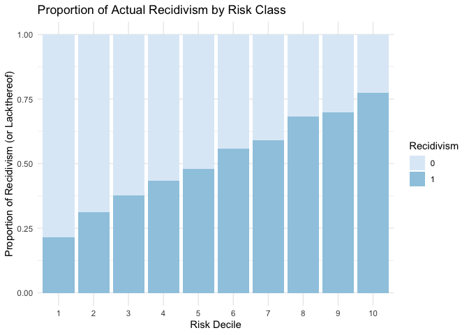<!-- -->

``` r
#I am going to use regression to see if the algorithm significantly predicts recidivism. It does, but it only explains 12% of the variance in recidivism.  
reg <- lm(two_year_recid ~ decile_score, compas)
summary(reg)
```

    ## 
    ## Call:
    ## lm(formula = two_year_recid ~ decile_score, data = compas)
    ## 
    ## Residuals:
    ##     Min      1Q  Median      3Q     Max 
    ## -0.7861 -0.3584 -0.2362  0.4583  0.7638 
    ## 
    ## Coefficients:
    ##              Estimate Std. Error t value Pr(>|t|)    
    ## (Intercept)  0.175146   0.010254   17.08   <2e-16 ***
    ## decile_score 0.061094   0.001921   31.80   <2e-16 ***
    ## ---
    ## Signif. codes:  0 '***' 0.001 '**' 0.01 '*' 0.05 '.' 0.1 ' ' 1
    ## 
    ## Residual standard error: 0.466 on 7212 degrees of freedom
    ## Multiple R-squared:  0.123,  Adjusted R-squared:  0.1229 
    ## F-statistic:  1011 on 1 and 7212 DF,  p-value: < 2.2e-16

## Exercise 6 & 7

Overall, the algorithm was right 4,670 times out of 7,214, which is 64%
accurate.

``` r
compas <- compas %>%
  mutate(compas_correct_or_not = case_when(
    decile_score >= 7 & two_year_recid == 1 ~ 1, #True positive
    decile_score < 7 & two_year_recid == 0 ~ 1, #True negative
    decile_score >=7 & two_year_recid == 0 ~ 0, #False positive
    decile_score < 7 & two_year_recid == 1 ~ 0)) #False negative 

compas <- compas %>%
  mutate(compas_class = as.factor(case_when(
    decile_score >= 7 & two_year_recid == 1 ~ "TP", #True positive
    decile_score <=4 & two_year_recid == 0 ~ "TN", #True negative
    decile_score >=7 & two_year_recid == 0 ~ "FP", #False positive
    decile_score <= 4 & two_year_recid == 1 ~ "FN",
    decile_score <4 & decile_score < 7 ~ "Mid"))) #False negative 

table(compas$compas_class)
```

    ## 
    ##   FN   FP   TN   TP 
    ## 1216  644 2681 1351

``` r
table(compas$compas_correct_or_not)
```

    ## 
    ##    0    1 
    ## 2544 4670

``` r
#these are ugly, just for my own understanding
ggplot(compas, aes(x=compas_class)) +
  geom_bar()
```

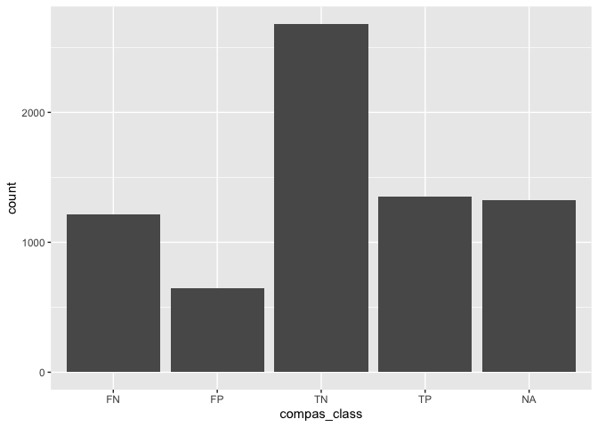<!-- -->

``` r
ggplot(compas, aes(x=compas_correct_or_not, fill = compas_class)) +
  geom_bar(position = "fill")
```

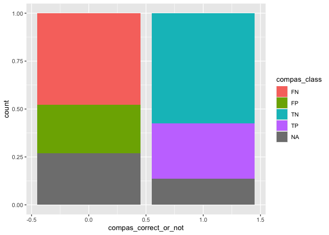<!-- -->

Additional Exercises  
Now let’s assess how well the COMPAS algorithm performs across different
demographic groups. Like ProPublica, we’ll focus on race, but you can
explore others.

## Exercise 8

Black defendants are more frequently assigned as high risk, whereas
white defandants tend to have lower risk scores.

``` r
compas %>%
  filter(race == "African-American" | race == "Caucasian") %>%
ggplot(aes(x=nom_decile_score)) +
  geom_bar() +
  facet_wrap(~race) +
  labs(title = "Distribution of Risk Decile Scores by Race",
       x="Decile Score",
       y = "Frequency")
```

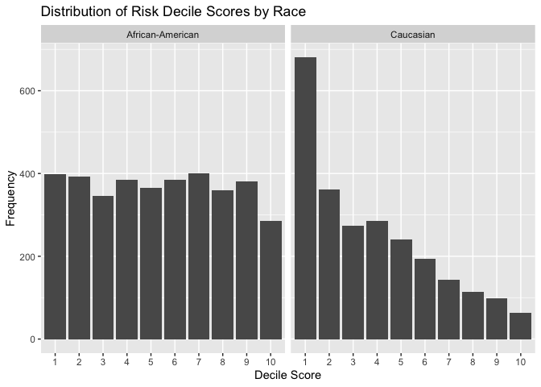<!-- -->

## Exercise 9

38.5% of black defendants are high risk versus 16.5% of white
defendants. This is a large dispairity.

``` r
Bcompas <- compas %>%
  filter(race == "African-American")

Wcompas <- compas %>%
  filter(race == "Caucasian")

table(Bcompas$decile_score)
```

    ## 
    ##   1   2   3   4   5   6   7   8   9  10 
    ## 398 393 346 385 365 384 400 359 380 286

``` r
table(Wcompas$decile_score)
```

    ## 
    ##   1   2   3   4   5   6   7   8   9  10 
    ## 681 361 273 285 241 194 143 114  98  64

## Exercise 10

The algorithm tends to incorrectly assign white defendants as low risk
and black defendants as high risk.

The proportion of non-recidivists who had false positives is much higher
for black defendants.

``` r
#25% false positives for black defendants 
Bnon_recidivists <- Bcompas %>%
  filter(two_year_recid == 0)
table(Bnon_recidivists$compas_class)
```

    ## 
    ##  FN  FP  TN  TP 
    ##   0 447 990   0

``` r
#9% false positives for white defendants 
Wnon_recidivists <- Wcompas %>%
  filter(two_year_recid == 0)
table(Wnon_recidivists$compas_class)
```

    ## 
    ##   FN   FP   TN   TP 
    ##    0  136 1139    0

The proportion of recidivists who had false negatives was much higher
for white defendants.

``` r
#30% false negatives for black defendants 
Brecidivists <- Bcompas %>%
  filter(two_year_recid == 1)
table(Brecidivists$compas_class)
```

    ## 
    ##  FN  FP  TN  TP 
    ## 532   0   0 978

``` r
#48% false negatives for white defendants 
Wrecidivists <- Wcompas %>%
  filter(two_year_recid == 1)
table(Wrecidivists$compas_class)
```

    ## 
    ##  FN  FP  TN  TP 
    ## 461   0   0 283

## Exercise 11

False positives were twice as common for the black defendants versus
white. (Black defendant FP is 12% White defendant FP is 6%)

``` r
table(Bcompas$compas_class)
```

    ## 
    ##  FN  FP  TN  TP 
    ## 532 447 990 978

``` r
table(Wcompas$compas_class)
```

    ## 
    ##   FN   FP   TN   TP 
    ##  461  136 1139  283

``` r
compas %>%
    filter(race == "African-American" | race == "Caucasian") %>%
ggplot(aes(x=race, fill = compas_class)) +
  geom_bar(position = "fill") +
  scale_fill_manual(values = c("FP" = "red","FN" = "orange", "TP" = "grey", "TN" = "grey", "NA" = "grey")) +
  theme_minimal() +
  labs(title = "Proportion of Risk Classifications Among Black and White Defendants",
       x = "Race",
       y = "Frequency",
       fill = "Risk Class")
```

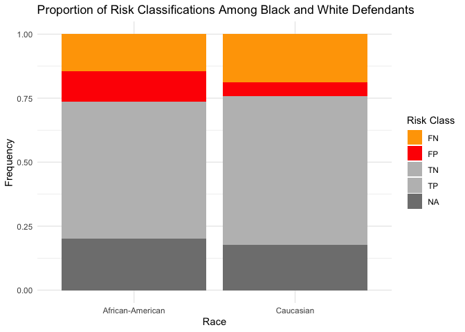<!-- --> \## Exercise
12

The algorithm weighs prior convictions more heavily for black
defendants. The colors won’t play nice in my graph, so thats why its
faceted instead.

``` r
compas %>%
    filter(race == "African-American" | race == "Caucasian") %>%
ggplot(aes(x=decile_score, y=priors_count)) +
  geom_jitter(alpha = 0.7) + 
 # scale_color_manual(values = c("African-American" = "blue", "Caucasion"="midnightblue")) +
  facet_wrap(~race) +
  theme(legend.position = "none") +
  theme_minimal() +
  labs(title = "Association of Prior Convictions and Risk Scores, by Race",
       x = "Risk Score",
       y = "Prior Convictions")
```

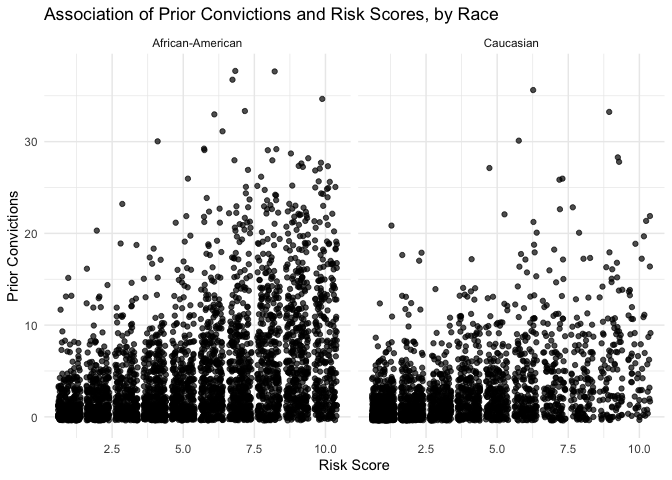<!-- -->

``` r
#I can't get the colors to play nice 
```

## Exercise 13

I don’t think the algorithm is fair. If it were, the false positive and
false negative ratings would be more similar across races. It is quite
alarming that the algorithm is more likely to incorrectly conclude that
a white person isn’t going to re offend or that a black person will. I
would be interested in seeing what these rates are for the other races
in the dataset.

My visualization of the calibration actually makes it seem like maybe
the algorithm is more fair than I originally thought (the second one,
not the first). This chart is in line with Northpointe’s claim. Similar
proportions of defendants at each decile reoffended. However, white
people are more likely to be given a lower risk score, so my chart was
probably biased from the beginning. The classification system is biased,
so I am personally not sure what to think.

``` r
# To check calibration, you can calculate recidivism rates by score for each race
df<- compas %>%
  filter(race == "African-American" | race == "Caucasian") %>%
  group_by(nom_decile_score, race) %>%
  summarize(reoffense_rate = mean(two_year_recid, na.rm = TRUE), .groups = "drop")

#not adjusted for the size of each group 
compas %>%
  filter(race == "African-American" | race == "Caucasian") %>%
ggplot(aes(x=nom_decile_score, y = two_year_recid)) +
  geom_col() +
  facet_wrap(~race) +
  labs(title = "Risk Decile Scores and Frequency of Reoffense",
       x="Decile Score",
       y = "# Reoffenders")
```

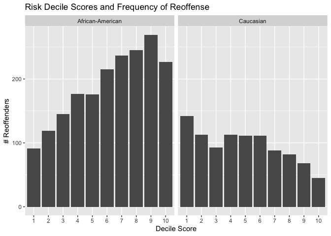<!-- -->

``` r
#Using proportions of reoffense at each decile 
ggplot(df, mapping = aes(x=nom_decile_score, y=reoffense_rate)) +
  geom_col() +
  facet_wrap(~race) +
  labs(title = "Risk Decile Scores and Proportions of Reoffense",
       x="Decile Score",
       y = "Proportion of Reoffenders")
```

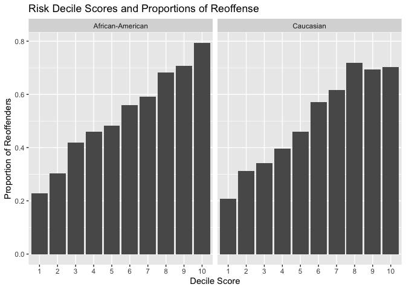<!-- -->

## Exercise 14

I think the focus should be on optimizing the predictive power of the
algorithm for each race. I think fair = accurate predictions, and given
how much inequality exists in the justice system, I think its possible
that one combination of factors might do a good job predicting for one
race, while another combination might be best for another. That said, I
don’t think its possible to create a fair algorithm, because the data
feeding the algorithm is based off of an unjust system. For example,
prior offenses are part of the algorithm, but black people are more
likely to be unfairly charged for crimes. The justice system underlying
the data is unfair, so the algorithm can be as “fair” on paper as we
want, but it is based on biased information.

I do think its important to adjust the algorithm so that it is not more
or less likely that there is a false positive / false negative based on
race - the fact that white people are more likely to get false
negatives, and black people false positives, is terrible.

## Exercise 15

On the one hand, a fair algorithm might be one that assigns risk based
on exactly the same information, and weights this information in the
same manner (e.g. prior offenses being weighted the same across races).
On the other, a fair algorithm can also be thought of as one that make
the most accurate predictions, and this could involve using different
combinations of predictors / weighting to accomplish this end.

## Exercise 16

The justice system needs to be more fair overall, that way the data the
algorithm uses is less biased. I also think that the algorithm should
not be interpreted as the “be all end all.” There should be multiple
other things to consider about the person to make a determination about
risk - e.g. face to face interviews, mental health evaluations - to get
a more comprehensive understanding of the defendant.
